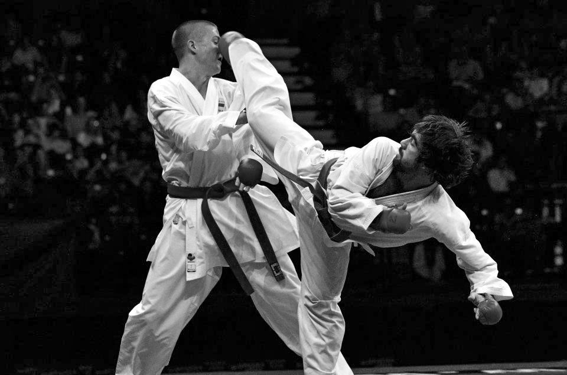

# Kumite - A Sparring Video Game

This design document for *Kumite* is scoped for a minimum viable product. There will be features lacking that would be present in a more polished version. I've purposely left out description of the game's aesthetics because I just don't want to get too excited and ahead of myself.

## Overview

Inspired by *Karate Tournament*, *Nidhogg*, and *Virtua Fighter*, *Kumite* is a 3D sparring game that seeks to refine the pre-*Street Fighter II* design of early fighting games by returning to a more deliberate, tactical style of gameplay. 
Players fight in flat 3D arenas, fighting traditional rounds—first to three—with health points and a timer.

### Character Select

There are no unique characters in *Kumite*. Players select their gi colour to distinguish themselves in a match, but characters will otherwise appear identical.

### Time Out

If the timer runs out, the player with the most health will win the round. If both players' health is tied, the round counts as a draw, and a round will be awarded to both players. Games cannot end as a draw and if the final match draws, extra rounds are played until there is a single winner.

## Controls

*Kumite* is played using a Joystick  and three buttons: Punch , Kick , and Evade .

Command (when facing right) | Motion
------------ | -------------
 | Punch
 | Kick
 | Evade
+ | Power attack
+or+ | Circular attack
 (hold) | High stance
 (hold) | Low stance
 or + | Dash forward
 or + | Back dash

### Stances

Unique to *Kumite* is the Stance system. Similar to games like *Nidhogg*, the player can hold up or down  on the joystick to switch to High or Low Stances. This changes what height of attacks will be used and what kinds of moves the player can guard against. When the joystick is neutral, the player is in Mid Stance. If an attack is active for multiple frames, as long as the first frame is correctly blocked, the defending player can switch out of that stance without getting hit. Most moves in fighting games are active for 1 or 2 frames.

### Blocking

Blocking in *Kumite* is automatic and will succeed if the player is not attacking, dashing, or evading while in the correct stance. Kumite does not have chip damage. If one player holds the joystick up to strike high, the other player must be holding the joystick up in the high stance to block the strike.

### Punches and Kicks

Punch  and Kick . Generally, punches have shorter range but come out faster, while kicks have a greater range but have a longer startup period. Hitting the enemy with the joystick in neutral will produce a Middle attack, while holding up while attacking strikes High, and holding down while attacking strikes Low. Striking a standing opponent will do 1 point of damage, while striking an enemy from the side or behind will do 1.5 points of damage. 

### Followup Attacks

*Kumite* does not have a conventional combo system. Rather, normal attacks can follow up with one other normal attack, in any of the three Stances. There is a short delay between the first attack and the followup to give the defending player a chance to block the second attack, even if they were hit by the first move. If both attacks hit the enemy, they will be Knocked Down. If the first attack whiffs, the followup attack will come out with reduced startup time. Followup attacks do 1 point of damage.

### Power Attacks

Power Attacks are performed by pressing Punch and Kick together (+). Power Attacks are slower strikes with long windups that Knock Down and do 3 points of damage. Power Attacks can be performed in each of the stances.

### Circular Attacks

Pressing Punch and Evade or Kick and Evade (+ or +) will perform a Circular Attack. Circular Attacks travel through the foreground and background, hitting opponents that the attacker is not tracking. Circular Attacks can be performed in each of the High, Mid and Low Stances. Circular Attacks are not affected by whether Punch or Kick was pressed. Some Circular Attacks may travel in only one direction while others may cover both directions.

### Evade

Evade  will be covered in the Movement section.

### Input Buffer

Input buffers function as normal in other fighting games. In *Virtua Fighter 5* the input buffer is 10 frames. In *KOF* the input buffer is 4 frames for normal moves and 13 frames for special/super moves. In ArcSys games, if a button is held down, the game repeats the button pressed for 3 frames.

### Button Priority

Button priority is (>>). So pressing all three buttons will perform a Circular Attack.

## Movement

### Walking

Players can walk back or forward by holding the Joystick left or right. When walking normally, players will be in Mid Stance. Holding a diagonal input () allows the player to move back or forward while maintaining a high or low stance.

### Dashing

Players can dash forward or back with a double forward or backward tap of the Joystick ( and ), or by tapping forward or back while Evading (+and+). when dashing, players cannot guard, and any attack that hits them will perform a Knockdown. Forward dashes can be canceled by tapping back on the joystick to control spacing and quickly guard. Back dashes can not be canceled. Players cannot Attack or Evade during a dash. After a successful dash, there is a brief few frames of recovery. *KOF* has 1 frame startup for dashes. In ArcSys games, backdashes are invincible for the first 6 frames.

### Evading

Evading  allows players to move in a sideways direction clockwise or counterclockwise into the foreground or background. This allows players to evade the opponent’s attack and expose their side or back, or to change positions around the ring. Tapping  will dodge into the background, and tapping the Joystick up or down alongside Evade will dash into the background or foreground. Players are invincible during the evade and for 1 frame afterward (not the recovery frames). If a player is Side Turned, they will have to wait 3 for frames before they can Evade. Players are otherwise treated as being in Mid Stance while Evading. If the joystick is held up or down while Evading, the player will return to that stance after the Evade.

A successful evade takes 23 frames, with 10 frames being recovery. Unsuccessful evades take longer. I ballpark 28 frames. This number is taken from *Virtua Fighter*, but *Kumite* may need more recovery frames on evades to prevent evades from being the dominant strategy.

### A note on Jumping and Crouching

*Kumite* will go down in history as the first fighting game to intentionally remove Jumping and Crouching. Simply put, this is not a title with an air game, and ducking under and jumping over attacks are not necessary, due to the stance guard system. In low stance, the player will go lower to the ground, but not enough to avoid high attacks. Landing some power attacks may launch the defending player in the air.

## Attacks

### Attack Phases

Attack phases function as they do in other fighters, with an execution phase, an active phase, and a recovery phase. Attacks take significantly longer to perform compared to other fighters, due to *Kumite*’s high damage and focus on reading opponent movement and striking at the right opportunity. The frame data from *Karate Tournament* and the *Samurai Shodown* series would make for good references. 

### Knockback

Ground control plays a heavy role in *Kumite*. Attacks cause a large and equal amount of knockback whether they are blocked or eaten. In *Karate Tournament*, the player can be pushed out of the arena by knockback from default position in 6 normal hits or 3 power hits, assuming they don’t move. This suggests that power attacks cause exactly double the knockback of normal attacks. They would also have, on average, double the recovery time.  Knockback will have to be examined against punch/kicks, and a decision will have to be made whether blocking players will be able to respond with an attack, if they have frame advantage.

### Attack Trades

If both players trade:
- The attack that does the higher damage wins
- If the damage is equal, neither player will receive damage. A visual indicator will appear to let players know that the trade was equal, and both players will be pushed back the amount of a power attack. Players cannot be knocked off the arena in this way and will instead land one step away from the edge.

### Attack Tracking

Tracking functions the same as in *Virtua Fighter*. Attacks do not automatically track, but if the defending player presses a button, the attack will track and they will get hit. Power attacks have long execution times, so the chances of tracking the opponent are increased since during this time, the opponent is likely to press a button.

## States

### Standing

Standard state. This is the only state where the player can block, attack, switch stances or evade.

### Knocked Down

Players enter the Knockdown state after being hit by an attack and its followup attack, a power attack, or from falling off the arena. In this state the player cannot be hit, and both players are reset to their default positions in the middle of the arena. Knockdowns exist to moderate the pacing of the match, to allow players to register what caused the Knockdown, and to remove the wakeup game from the fighting design template.

### Side/Back Turned

Characters enter the Side Turned state from evading. When Side Turned, players cannot block. Neutral attacks do 1.5 damage to side turned opponents. When a player has been hit during the Side Surned state, they will instantly return to Standing state. It takes 3 frames to be able to face forward and block, or evade. After the 3 frames are up, pressing any direction will return the player to Standing State. Forward dashes do not input buffer when Side Turned. Standing players attacking Side Turned players get a +2 frame bonus on hit.

### Ring Out

If a player falls outside of the ring, they will suffer a Knockdown. The player that rings out will suffer 2 points of damage. Only one character can take damage from ringing out at a time. Players cannot walk off the ring and must dash, evade, or get pushed back or knocked off the ring.

## Future Concepts

In the future a "match structure" section will be needed, outlining pre-match and post-match gameplay. *Fighters Destiny* has a similar point system and could point to future gameplay expansion. Other possible ideas include:

- Multiple characters with unique abilities
- Throws to initiate knockdowns, control spacing
- Charge moves
- Pushblocking
- Pre-match movement like in *DOA*?

## References

- [Virtua Fighter Wiki](https://virtuafighter.com/wiki/index/)
- [HG101 Article on The Karate Tournament](http://www.hardcoregaming101.net/chatan-yarakuu-shanku/)
- [HG101 Article on Fighters Destiny](http://www.hardcoregaming101.net/fighters-destiny/)
